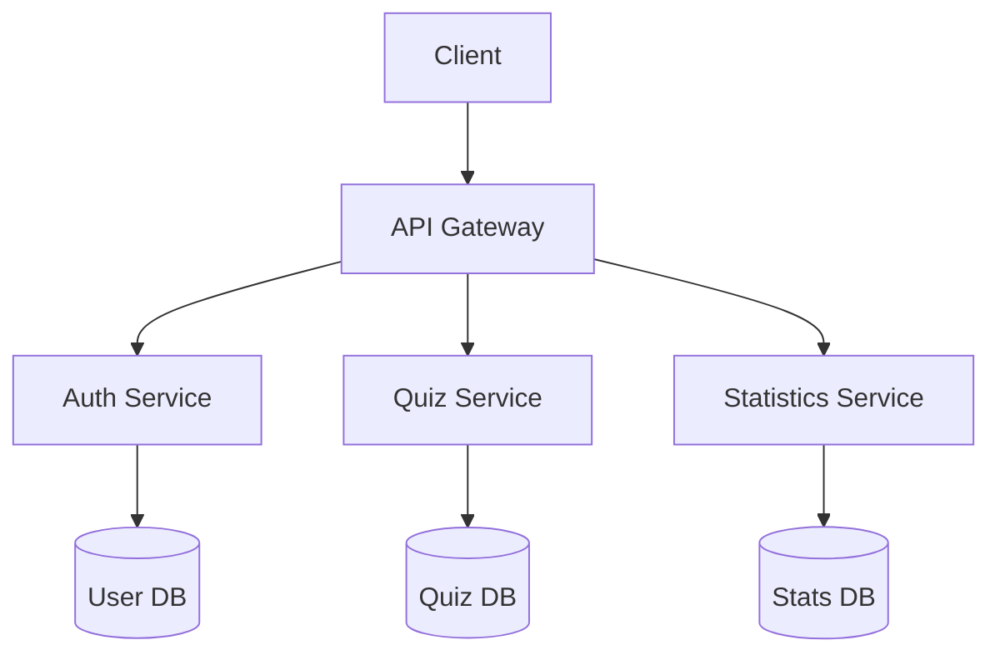
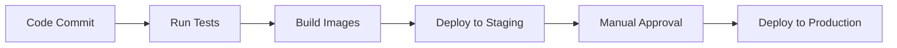

# Easy Quizy

---
## Table Of Contents

1. [About](#about)
2. [Architechture](#architechture)
3. [Stack](#stack)
4. [Microservices APIs](#microservices-apis)
   1. [Authentification service](#authentification-service)
   2. [Quiz service](#quiz-service)
   3. [Statistics service](#statistics-service)
5. [Deployment](#deployment)
6. [Development Setup](#development-setup)
7. [Monitoring](#monitoring)
8. [Testing](#testing)
9. [CI/CD Pipeline](#cicd-pipeline)

---
## About

This is a social network for quiz lovers. Here you can take quizzes from other users or create your own, find friends, compete in the overall rating of authors or players.

## Architechture 

Ну типа


## Stack

- Backend: Golang, Protobuf  
- Frontend: Vue.js
- DB: PostgreSQL, Redis
- DevOps: Docker

## Microservices APIs

### Authentification service

Read more on [Authentification service](/auth_service/README.md)

#### Methods

- **Register**: Creates a new user account

- **Login**: Authenticates a user and returns JWT token

- **Logout**: Invalidates user session token

- **ValidateToken**: Verifies JWT token validity

- **GetMe**: Retrieves current user profile

- **UpdateMe**: Updates user profile information

- **AddFriend**: Adds another user to friends list

- **RemoveFriend**: Removes user from friends list

- **AddFavoriteQuiz**: Adds quiz to user favorites

- **GetFavoriteQuizzes**: Lists user's favorite quizzes

- **RemoveFavoriteQuiz**: Removes quiz from favorites

### Quiz service

Read more on [Quiz service](/quiz_service/README.md)

#### Methods

- **CreateQuiz**: Creation of new quiz

- **GetQuiz**: Get quiz by ID

- **GetQuizByAuthor**: List of all authors' quizzes 

#### Data Models 

**Question**
```protobuf
message Question {
    string question_text = 1; // Question text
    optional string image_id = 2; // Image
    repeated Answer answers = 3;  // Answers options
}
```
**Answer**
```protobuf
message Answer {
    string answer_text = 1; // Text of answer
    bool is_correct = 2;    // Is this answer correct
}
```
**Hint**: every quiz must contain at least 1 question, every question must contain at least 2 answers and only one of them is correct.


### [Statistics service]("https://gitlab.crja72.ru/golang/2025/spring/course/projects/go14/easy-quizy/-/blob/main/stat_service/README.md")

Read more on [Statistics service](stat_service/README.md)

#### Methods
- **UpdateStats**: Updates statistics for a quiz session
  
- **GetQuizStats**: Retrieves statistics for a specific quiz
  
- **ListQuizzes**: Lists quizzes sorted by a specified option
  
- **GetPlayerStat**: Retrieves statistics for a specific player
   
- **GetAuthorStat**: Retrieves statistics for a specific author

- **ListAuthors**: Lists authors sorted by a specified option
  
## Deployment

### Prerequisits
- Docker 20.10+
- PostgreSQL

### Steps

## Development Setup

## Monitoring

### Logger

## Testing

## CI/CD Pipeline

