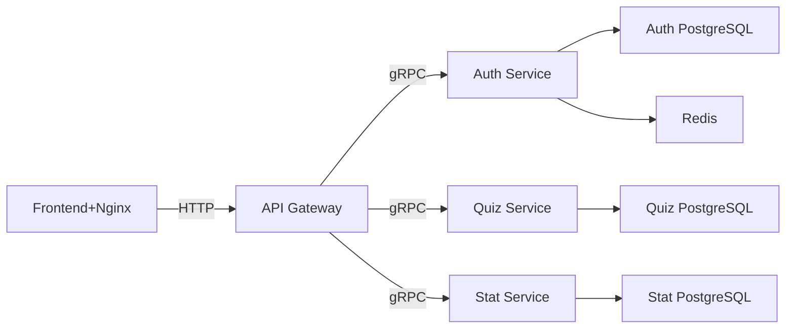
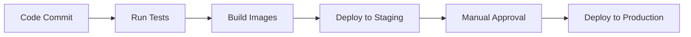

# Easy Quizy

---
## Table Of Contents


1. [О проекте](#о-проекте)
2. [Архитектура](#архитектура)
3. [Технологический стек](#технологический-стек)
4. [Микросервисы](#микросервисы)
   1. [Сервис аутентификации](#сервис-аутентификации)
   2. [Сервис квизов](#сервис-квизов)
   3. [Сервис статистики](#сервис-статистики)
5. [Развертывание](#развертывание)
6. [Настройка для разработки](#настройка-для-разработки)
7. [Мониторинг](#мониторинг)
8. [Тестирование](#тестирование)
9. [CI/CD Pipeline](#cicd-pipeline)

---
## О проекте

Платформа для любителей квизов. Пользователи могут:
- Проходить квизы других пользователей
- Создавать собственные квизы
- Добавлять друзей
- Соревноваться в рейтингах авторов и игроков

## Архитектура



### Ключевые особенности архитектуры:

- API Gateway: Единая точка входа для всех запросов

- Изолированные БД: Каждый сервис имеет свою БД

- Кеширование: Использование Redis, для кеширования данных

## Технологический стек

- Технологический стек
- Бэкенд: Golang, Protobuf/gRPC

- Фронтенд: Vue.js 3

- Базы данных: PostgreSQL, Redis

- Инфраструктура: Docker, Docker Compose

## Микросервисы

### Сервис-аутентификации

Больше информации в [Сервисе аутентификации](/auth_service/README.md)

#### Методы

- **Register**: Создает аккаунт

- **Login**: Вход в аккаунт и возвращение jwt токена

- **Logout**: Выход из аккаунта

- **ValidateToken**: Валидация jwt токена

- **GetMe**: Получение информации о пользователе

- **GetUser**: Получение информации о пользователе по уникальному идентификатору

- **UpdateMe**: Обновление информации о пользователе

- **AddFriend**: Добавление в список друзей

- **RemoveFriend**: Удаление из списка друзей

- **AddFavoriteQuiz**: Добавление квиза в избранное

- **GetFavoriteQuizzes**: Получение всех квизов из избранного

- **RemoveFavoriteQuiz**: Удаление квиза из списка избранного

#### Data models

**User**
```protobuf
message User {
    string id = 1;
    string username = 2;
    string email = 3;
    string hash_pass =4
    google.protobuf.Timestamp created_at = 5;
    google.protobuf.Timestamp updated_at = 6;
}
```

### Сервис квизов

Больше информации в [Сервисе квизов](/quiz_service/README.md)

#### Методы

- **CreateQuiz**: Создание нового квиза

- **GetQuiz**: Получение квиза по id

- **GetQuizByAuthor**: Список авторских квизов

- **GetQuizzes**: Список всех квизов 


### [Сервис статистики]("https://gitlab.crja72.ru/golang/2025/spring/course/projects/go14/easy-quizy/-/blob/main/stat_service/README.md")

Подробности в [Сервисе статистики](stat_service/README.md)

#### Methods
- **UpdateStats**: Обновляет статистику
  
- **GetQuizStats**: Отправляет статистику квиза
  
- **ListQuizzes**: Список квизов отсортированный
  
- **GetPlayerStat**: Отправляет статистику игрока
   
- **GetAuthorStat**: Отправляет статистику автора

- **ListAuthors**:Список авторов отсортированный
  
## Развертывание

### Требования
- Docker 20.10+
- PostgreSQL 15+
- 4GB+ свободной памяти
- 2+ ядра CPU

### Шаги

1. Клонирование репозитория:
```bash
git clone https://gitlab.crja72.ru/golang/2025/spring/course/projects/go14/easy-quizy.git
cd easy-quizy
```
2. Настройка переменных окружения. Смотрите папку config

3. Запуск сервисов:
```bash
docker-compose up -d
```

## Настройка-для-разработки

1. Установка зависимостей:

```bash
# Для бэкенда
cd <name_service> && go mod download

# Для фронтенда
cd frontend_with_nginx && npm install
```

2. Для каждого из сервисов настроен свой makefile с документированием команд, поэтому, чтобы запустить какой-либо из сервисов просмотрите makefile'ы, например, можете выполнить команду:

```bash
make run
```

Для auth-сервиса данная команда собирает сервис прогоняет миграции, а также поднимает сервис в докере.

## Тестирование

### Виды тестов:

1. Unit-тесты:
- Покрытие критической бизнес-логики
- Изолированное тестирование компонентов

2. Integrations тесты:
- Работа с тестовыми БД

Всегда прогоняйте тесты в процессе разработки, для того, чтобы убедиться, что все работает исправно. Сделать вы это можете с помощью того же makefile для каждого сервиса, пример:

```bash
# Запуск unit-тестов
make test

# Запуск интеграционных тестов:
make test-integration
```

## CI/CD Pipeline


