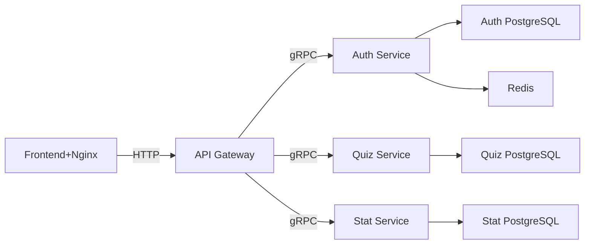
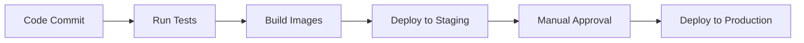

# Easy Quizy

---
## Table Of Contents


1. [О проекте](#о-проекте)
2. [Архитектура](#архитектура)
3. [Технологический стек](#технологический-стек)
4. [Микросервисы](#микросервисы)
   1. [Сервис аутентификации](#сервис-аутентификации)
   2. [Сервис квизов](#сервис-квизов)
   3. [Сервис статистики](#сервис-статистики)
5. [Развертывание](#развертывание)
6. [Настройка для разработки](#настройка-для-разработки)
7. [Мониторинг](#мониторинг)
8. [Тестирование](#тестирование)
9. [CI/CD Pipeline](#cicd-pipeline)

---
## О проекте

Платформа для любителей квизов. Пользователи могут:
- Проходить квизы других пользователей
- Создавать собственные квизы
- Добавлять друзей
- Соревноваться в рейтингах авторов и игроков

## Архитектура



## Технологический стек

- Технологический стек
- Бэкенд: Golang, Protobuf/gRPC

- Фронтенд: Vue.js 3

- Базы данных: PostgreSQL, Redis

- Инфраструктура: Docker, Docker Compose

## Микросервисы

### Сервис-аутентификации

Больше информации в [Сервисе аутентификации](/auth_service/README.md)

#### Методы

- **Register**: Создает аккаунт

- **Login**: Вход в аккаунт и возвращение jwt токена

- **Logout**: Выход из аккаунта

- **ValidateToken**: Валидация jwt токена

- **GetMe**: Получение информации о пользователе

- **UpdateMe**: Обновление информации о пользователе

- **AddFriend**: Добавление в список друзей

- **RemoveFriend**: Удаление из списка друзей

- **AddFavoriteQuiz**: Добавление квиза в избранное

- **GetFavoriteQuizzes**: Получение всех квизов из избранного

- **RemoveFavoriteQuiz**: Удаление квиза из списка избранного

### Сервис квизов

Больше информации в [Сервисе квизов](/quiz_service/README.md)

#### Методы

- **CreateQuiz**: Creation of new quiz

- **GetQuiz**: Get quiz by ID

- **GetQuizByAuthor**: List of all authors' quizzes 

#### Data Models 

**Question**
```protobuf
message Question {
    string question_text = 1; // Question text
    optional string image_id = 2; // Image
    repeated Answer answers = 3;  // Answers options
}
```
**Answer**
```protobuf
message Answer {
    string answer_text = 1; // Text of answer
    bool is_correct = 2;    // Is this answer correct
}
```
**Hint**: every quiz must contain at least 1 question, every question must contain at least 2 answers and only one of them is correct.


### [Statistics service]("https://gitlab.crja72.ru/golang/2025/spring/course/projects/go14/easy-quizy/-/blob/main/stat_service/README.md")

Read more on [Statistics service](stat_service/README.md)

#### Methods
- **UpdateStats**: Updates statistics for a quiz session
  
- **GetQuizStats**: Retrieves statistics for a specific quiz
  
- **ListQuizzes**: Lists quizzes sorted by a specified option
  
- **GetPlayerStat**: Retrieves statistics for a specific player
   
- **GetAuthorStat**: Retrieves statistics for a specific author

- **ListAuthors**: Lists authors sorted by a specified option
  
## Deployment

### Prerequisits
- Docker 20.10+
- PostgreSQL

### Steps

## Development Setup

## Monitoring

### Logger

## Testing

## CI/CD Pipeline


